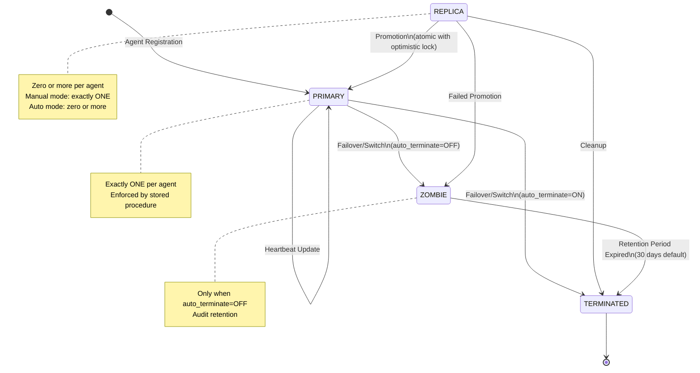
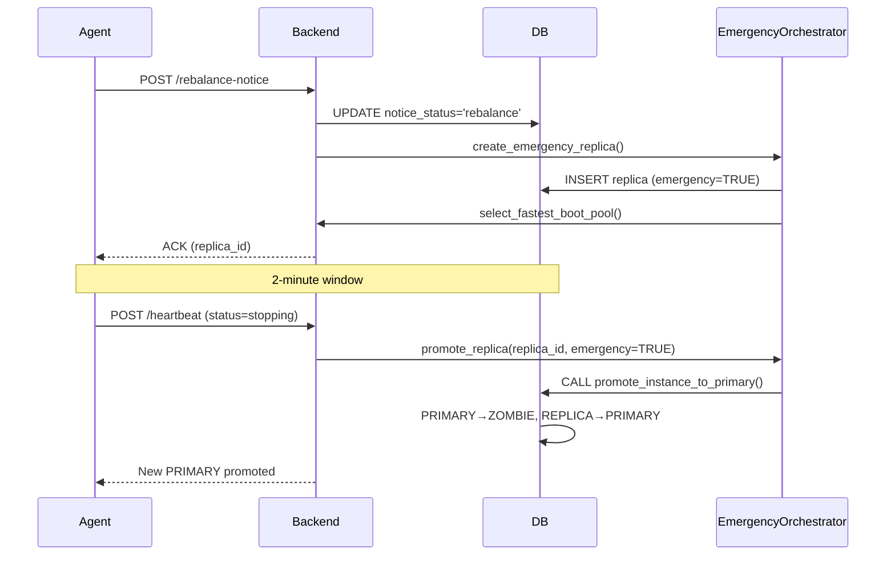
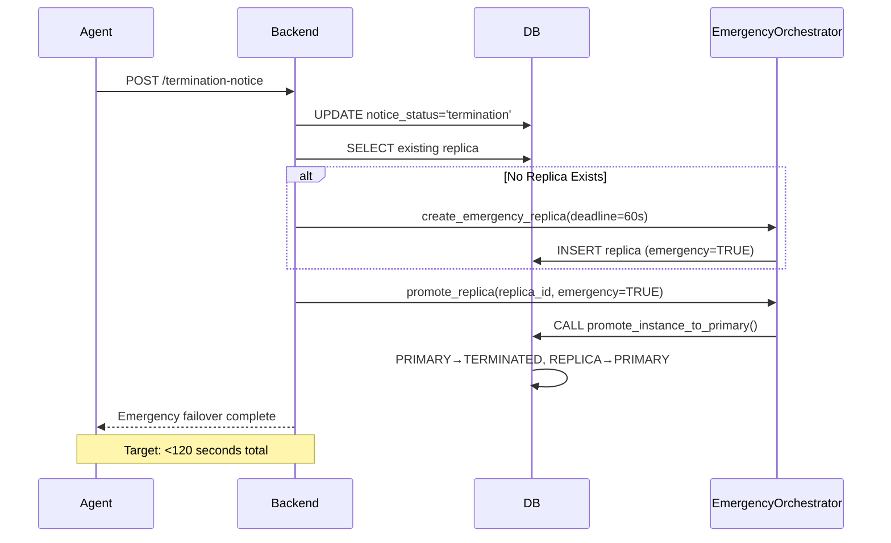

# Instance Lifecycle State Machine

## Overview

This document defines the formal state machine for instance role transitions in the AWS Spot Optimizer system. The state machine enforces critical invariants and ensures consistent instance lifecycle management.

---

## State Definitions

### PRIMARY
**Description**: Active production instance serving traffic
**Invariant**: Exactly one PRIMARY per agent at all times
**Characteristics**:
- `is_primary = TRUE`
- `instance_status = 'running_primary'`
- Actively serving application traffic
- Receives heartbeats from agent
- Can be switched or failed over

### REPLICA
**Description**: Standby instance ready for promotion
**Characteristics**:
- `is_primary = FALSE`
- `instance_status = 'running_replica'`
- State synchronized with PRIMARY
- Not serving production traffic (unless in manual replica mode)
- Can be promoted to PRIMARY

### ZOMBIE
**Description**: Decommissioned instance kept for audit
**Characteristics**:
- `is_primary = FALSE`
- `instance_status = 'zombie'`
- No longer serving traffic
- Retained for audit trail when `auto_terminate = FALSE`
- Eventually cleaned up after retention period

### TERMINATED
**Description**: Fully removed instance with finalized lifecycle
**Characteristics**:
- `instance_status = 'terminated'`
- `terminated_at` timestamp set
- Instance no longer exists in cloud
- Record kept for historical analysis

---

## State Transition Diagram



---

## Detailed State Transitions

### 1. Agent Registration → PRIMARY

**Trigger**: New agent registration or agent reinstallation
**Guards**:
- Instance not already marked as ZOMBIE
- Instance is marked as primary in registration data
- No version conflict

**Actions**:
```python
# Check for zombie status
if instance_status in ('zombie', 'terminated') or not is_primary:
    # Reject registration
    return {'config': {'enabled': False}}

# Create or update agent record
execute_query("""
    INSERT INTO agents (id, client_id, logical_agent_id, instance_id, status)
    VALUES (%s, %s, %s, %s, 'online')
    ON DUPLICATE KEY UPDATE
        instance_id = VALUES(instance_id),
        status = 'online',
        last_heartbeat_at = NOW()
""", (agent_id, client_id, logical_agent_id, instance_id))

# Create PRIMARY instance record
execute_query("""
    INSERT INTO instances
    (id, client_id, agent_id, is_primary, instance_status)
    VALUES (%s, %s, %s, TRUE, 'running_primary')
""", (instance_id, client_id, agent_id))
```

**Postconditions**:
- Exactly one PRIMARY exists for this agent
- Agent status = 'online'
- Instance record created with `is_primary = TRUE`

---

### 2. PRIMARY → ZOMBIE (Manual Switch, auto_terminate=OFF)

**Trigger**: Manual switch or failover with auto_terminate disabled
**Guards**:
- `auto_terminate_enabled = FALSE`
- New PRIMARY successfully launched
- Optimistic lock version check passes

**Actions**:
```python
# Atomic transition with optimistic locking
success = call_stored_procedure('promote_instance_to_primary', (
    new_instance_id,
    agent_id,
    expected_version
))

# Old PRIMARY automatically becomes ZOMBIE
```

**SQL (Inside Stored Procedure)**:
```sql
START TRANSACTION;

-- Demote old PRIMARY to ZOMBIE
UPDATE instances
SET instance_status = 'zombie',
    is_primary = FALSE,
    terminated_at = NOW()
WHERE agent_id = p_agent_id
    AND is_primary = TRUE
    AND instance_status = 'running_primary'
    AND id != p_instance_id;

-- Promote new instance
UPDATE instances
SET instance_status = 'running_primary',
    is_primary = TRUE,
    version = version + 1
WHERE id = p_instance_id
    AND agent_id = p_agent_id
    AND version = p_expected_version;

COMMIT;
```

**Postconditions**:
- Old PRIMARY marked as ZOMBIE
- New PRIMARY active
- Exactly one PRIMARY per agent maintained
- Audit trail preserved

---

### 3. PRIMARY → TERMINATED (Manual Switch, auto_terminate=ON)

**Trigger**: Manual switch or failover with auto_terminate enabled
**Guards**:
- `auto_terminate_enabled = TRUE`
- New PRIMARY successfully launched and healthy
- Terminate wait period elapsed

**Actions**:
```python
# Demote to ZOMBIE first (transactional)
promote_instance_to_primary(new_instance_id, agent_id, expected_version)

# Then terminate after wait period
sleep(terminate_wait_seconds)

# Mark as terminated
execute_query("""
    UPDATE instances
    SET instance_status = 'terminated',
        terminated_at = NOW()
    WHERE id = %s
""", (old_instance_id,))

# Actual cloud termination
aws_ec2.terminate_instances(InstanceIds=[old_instance_id])
```

**Postconditions**:
- Old instance terminated in cloud
- Database record marked `terminated`
- No ZOMBIE created

---

### 4. REPLICA → PRIMARY (Emergency Promotion)

**Trigger**: Emergency event (rebalance/termination notice) or manual promotion
**Guards**:
- REPLICA status = 'ready' (synced)
- Health check passes (optional in emergency)
- Optimistic lock check passes

**Actions**:
```python
# Emergency promotion flow
def promote_replica(replica_id, emergency=False):
    replica = get_replica(replica_id)

    if not emergency:
        # Verify health
        health = verify_replica_health(replica_id)
        if not health['healthy']:
            raise PromotionFailed(health['reason'])

    # Atomic transaction
    operations = [
        # Update replica status
        ("UPDATE replica_instances SET status = 'promoted', promoted_at = NOW() WHERE id = %s",
         (replica_id,)),

        # Demote old PRIMARY
        ("UPDATE instances SET instance_status = 'zombie', is_primary = FALSE WHERE agent_id = %s AND is_primary = TRUE",
         (replica['agent_id'],)),

        # Create new PRIMARY from replica
        ("INSERT INTO instances (id, client_id, agent_id, instance_type, region, az, is_primary, instance_status) "
         "SELECT instance_id, client_id, agent_id, instance_type, region, az, TRUE, 'running_primary' "
         "FROM replica_instances WHERE id = %s",
         (replica_id,))
    ]

    success = execute_transaction(operations)
    return success
```

**Postconditions**:
- REPLICA promoted to PRIMARY
- Old PRIMARY demoted to ZOMBIE
- Agent continues serving traffic with minimal downtime

---

### 5. ZOMBIE → TERMINATED (Retention Period Expired)

**Trigger**: Scheduled cleanup job (30-day default retention)
**Guards**:
- `terminated_at < NOW() - INTERVAL 30 DAY`
- `instance_status = 'zombie'`

**Actions**:
```python
# Scheduled job runs daily
def cleanup_zombies():
    zombies = execute_query("""
        SELECT id FROM instances
        WHERE instance_status = 'zombie'
            AND terminated_at < NOW() - INTERVAL 30 DAY
    """, fetch_all=True)

    for zombie in zombies:
        # Mark as terminated
        execute_query("""
            UPDATE instances
            SET instance_status = 'terminated'
            WHERE id = %s
        """, (zombie['id'],), commit=True)

        # Log for audit
        log_system_event('zombie_cleanup', 'info',
                        f"Zombie instance {zombie['id']} cleaned up")
```

**Postconditions**:
- ZOMBIE marked as TERMINATED
- Retained in database for historical analysis
- No longer counted in zombie metrics

---

## Guard Conditions

### Optimistic Locking

All state transitions that modify instance roles use optimistic locking:

```python
def transition_with_lock(instance_id, new_status, expected_version):
    affected = execute_query("""
        UPDATE instances
        SET instance_status = %s,
            version = version + 1
        WHERE id = %s
            AND version = %s
    """, (new_status, instance_id, expected_version), commit=True)

    if affected == 0:
        raise OptimisticLockConflict(
            f"Version conflict for instance {instance_id}"
        )
```

### Invariant Enforcement

**Exactly One PRIMARY per Agent**:
- Enforced by `promote_instance_to_primary()` stored procedure
- Uses database transaction to demote old + promote new atomically
- Version check prevents race conditions

**Mutual Exclusivity (Auto-Switch XOR Manual Replica)**:
```python
# Validated at API level
if agent['auto_switch_enabled'] and agent['manual_replica_enabled']:
    return error_response(
        "Auto-switch and manual replica are mutually exclusive",
        "INVALID_CONFIGURATION"
    )
```

---

## Emergency Flow State Transitions

### Rebalance Notice (Best Case: 2-minute window)



### Termination Notice (Worst Case: Immediate)



---

## Concurrency Handling

### Race Condition: Concurrent Promotions

**Scenario**: Two replicas try to promote simultaneously

**Solution**: Optimistic locking with stored procedure

```sql
-- Only one will succeed due to transaction + version check
CALL promote_instance_to_primary(
    'replica-1',  -- Will succeed
    'agent-123',
    expected_version=5
);

CALL promote_instance_to_primary(
    'replica-2',  -- Will fail with version conflict
    'agent-123',
    expected_version=5  -- Version already incremented to 6
);
```

### Race Condition: Heartbeat During Promotion

**Scenario**: Agent sends heartbeat while promotion in progress

**Solution**: Heartbeat uses separate version check

```python
# Heartbeat only updates if current state is PRIMARY
execute_query("""
    UPDATE agents
    SET last_heartbeat_at = NOW()
    WHERE id = %s
        AND status = 'online'
""", (agent_id,), commit=True)

# Does not conflict with instance promotion transaction
```

---

## Performance Considerations

### Transaction Isolation
- **Level**: READ COMMITTED (default for MySQL)
- **Lock Duration**: Minimized to promotion transaction only
- **Timeout**: 5 seconds max for promotion

### Index Usage
- `idx_instances_agent_primary` on `(agent_id, is_primary, instance_status)`
- Ensures fast lookups for current PRIMARY
- Supports atomic constraint checking

### Stored Procedure Benefits
- Reduces round trips (1 call vs 2+ queries)
- Atomic with transaction
- Enforces invariants at database level

---

## Monitoring & Alerts

### State Transition Metrics

```promql
# PRIMARY promotion rate
rate(instance_promotions_total[5m])

# Promotion failures
rate(instance_promotion_failures_total[5m])

# Zombie accumulation
instance_status{status="zombie"}

# Average promotion time
histogram_quantile(0.95, rate(instance_promotion_duration_seconds_bucket[5m]))
```

### Critical Alerts

1. **Multiple PRIMARY per Agent**
   - Query: `SELECT agent_id, COUNT(*) FROM instances WHERE is_primary=TRUE GROUP BY agent_id HAVING COUNT(*) > 1`
   - Severity: CRITICAL
   - Action: Immediate investigation

2. **Promotion Timeout**
   - Condition: Promotion takes > 10 seconds
   - Severity: WARNING
   - Action: Check database performance

3. **Zombie Accumulation**
   - Condition: Zombies > 100 per client
   - Severity: WARNING
   - Action: Review auto_terminate settings

---

## Testing State Transitions

### Unit Tests

```python
def test_promote_instance_to_primary():
    # Setup: Create PRIMARY and REPLICA
    agent_id = create_test_agent()
    old_primary = create_test_instance(agent_id, is_primary=True, version=1)
    new_instance = create_test_instance(agent_id, is_primary=False, version=1)

    # Execute: Promote new instance
    success = call_stored_procedure('promote_instance_to_primary', (
        new_instance['id'],
        agent_id,
        1  # expected_version
    ))

    # Assert: Exactly one PRIMARY
    assert success
    primaries = get_primaries_for_agent(agent_id)
    assert len(primaries) == 1
    assert primaries[0]['id'] == new_instance['id']

    # Assert: Old PRIMARY is ZOMBIE
    old = get_instance(old_primary['id'])
    assert old['instance_status'] == 'zombie'
    assert old['is_primary'] == False
```

### Integration Tests

```python
def test_emergency_promotion_under_2_minutes():
    # Setup: Create agent with rebalance notice
    agent_id = create_test_agent()
    instance_id = create_test_instance(agent_id, is_primary=True)

    # Trigger: Rebalance notice
    start_time = time.time()
    response = post_rebalance_notice(agent_id, notice_time=datetime.now())
    replica_id = response['data']['emergency_replica_id']

    # Wait for replica to be ready
    wait_for_replica_ready(replica_id, timeout=120)

    # Promote replica
    promote_replica(replica_id, emergency=True)
    end_time = time.time()

    # Assert: Completed within 2 minutes
    duration = end_time - start_time
    assert duration < 120, f"Emergency promotion took {duration}s (>120s)"

    # Assert: New PRIMARY is healthy
    new_primary = get_primary_for_agent(agent_id)
    assert new_primary['id'] != instance_id
    assert new_primary['is_primary'] == True
```

---

## State Machine Validation Checklist

- [x] Exactly one PRIMARY per agent enforced
- [x] Atomic transitions with optimistic locking
- [x] Emergency flows complete within 2 minutes
- [x] ZOMBIE retention for audit
- [x] Auto-terminate cleanup after retention
- [x] Mutual exclusivity of auto-switch and manual-replica
- [x] Version conflict detection and retry
- [x] Comprehensive audit logging
- [x] Performance monitoring hooks
- [x] Integration test coverage

---

**Document Version**: 1.0
**Last Updated**: 2024-11-26
**Maintained By**: AWS Spot Optimizer Team
